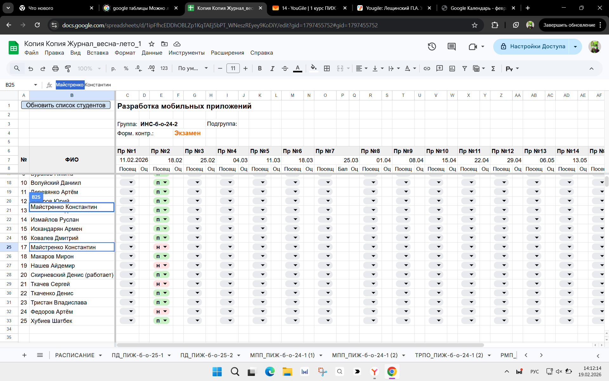

# Отчет

## Практическая работа №[Номер]

## [Полное название темы]

**Выполнил:**  
[ФИО]  
**Курс:** [Курс]  
**Группа:** [Номер группы]  
**Направление:** [Шифр и название направления]  
**Профиль:** [Название профиля подготовки]  

  **Проверил:**  
  [ФИО преподавателя]

---

### Цель работы

[текст цели работы]

### Ход работы
[Опишите кратко, что нужно было сделать в работе,вставив где нужно скриншоты с результатами выполнения].

*Рисунок 1. Общий вид программы / Главное окно*

*Рисунок 2. Результат выполнения тестового примера*

*Примечание по вставке изображений:*
*Скриншоты необходимо предварительно загрузить в репозиторий (например, в папку `images/`). Ссылка должна вести на файл внутри репозитория, а не на локальный диск вашего компьютера.*

### Вывод
В результате выполнения практической работы я [краткий вывод: что изучил, чему научился, что разработал].

### Ответы на контрольные вопросы
1.  **Вопрос 1:** [Ваш развернутый ответ на первый вопрос из методички].
2.  **Вопрос 2:** [Ваш ответ на второй вопрос].
3.  **Вопрос 3:** [Ваш ответ на третий вопрос].
